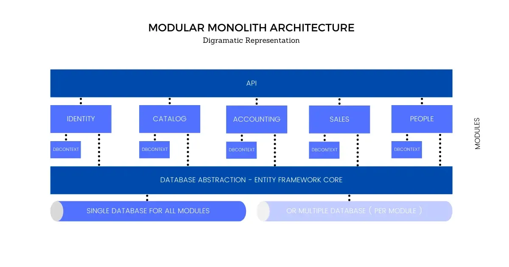
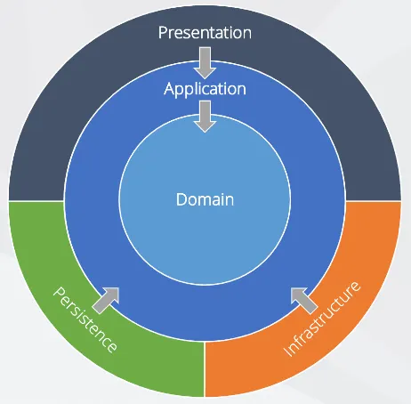

# Name
Noavaran Group ERP

## Architecture
### System Architecture

### Module Architecture
Onion Architecture

## Naming Conventions
https://learn.microsoft.com/en-us/dotnet/standard/design-guidelines/

Every module will be further split into API, Core, and Infrastructure projects to enforce Clean Onion Architecture.
Cross Module communication can happen only via Interfaces

## Libraries

### Serialization/Deserialization
System.Text.Json

### Unit testing
xUnit

### Logging
Serilog

### EF Core tools
**install**

`dotnet tool install --global dotnet-ef`

**update**

`dotnet tool update --global dotnet-ef`

Before you can use the tools on a specific project, you'll need to add the *Microsoft.EntityFrameworkCore.Design* and *Microsoft.EntityFrameworkCore.SqlServer* packages to it.

**dotnet ef dbcontext scaffold**

` dotnet ef dbcontext scaffold "Server=.\sql19;Database=NGERP;User Id=sa;Password=123;Trusted_Connection=True;Encrypt=False;" Microsoft.EntityFrameworkCore.SqlServer -d -o Domain\Entities -c ModuleDbContext --context-dir Infrastructure\DataAccess --schema ModuleSchema`

this command should be exexute at root of project

**Adds a new migration**

`dotnet ef migrations add <Name> -o Infrastructure\Migrations -c ModuleDbContext`

**Updates the database to the last migration or to a specified migration**

`dotnet ef database update`

## Creating project flow
1. In Module > Infrastructure > DataAccess
	1. Create ModuleDBContext.cs
	2. Create DependencyInjection.cs
	3. Create ModuleDBContextFactory.cs
2. In Module > Presntation > 
	- Create AssemblyReference.cs
3. API > Extensions > ServiceExtensions.cs
    - Add AddModuleInfrastructure from DependencyInjection to AddInfrastructures method    
4. In Module > Application > Interfaces > Repositories
	- Create IModuleRepositoryManager.cs
5. In Module > Infrastructure > DataAccess > Repositories 
    - Implement ModuleRepositoryManager.cs
6. In Module > Infrastructure > DataAccess  
    - Add ModuleRepositoryManager DI to DependencyInjection.cs
7. In Module > Application > Interfaces
	- Create IServiceManager.cs	
8. In Module > Application > Mappings
	- Create MappingProfile.cs
9. API > Extensions > ServiceExtensions.cs
    - Add AddModuleApplication from DependencyInjection to AddModuleApplications method    
10. In Module > Application > Services
	- Implement ServiceManager.cs
11. In Module > Application
	- Add ServiceManager DI to DependencyInjection.cs
12. In Module >	Presentation
	- Add AssemblyReference.cs
13. In Module > Domain > Entities
	- Create Entities.cs
14. In Module > Infrastructure > DataAccess > ModuleDBContext.cs
	- Add Entities DbSets
15. In Module > Application > Interfaces > Repositories
	1. Create IEntityRepository.cs
	2. Add IEntityRepository to IModuleRepositoryManager.cs
16. In Module > Infrastructure > DataAccess > Repositories
    1. Implement EntityRepository.cs
    2. Add EntityRepository to ModuleRepositoryManager.cs
17. In Module > Application > DTOs
	- Create EntityDto.cs, EntityForCreationDto.cs, EntityForManipulationDto.cs, EntityForUpdateDto.cs
18. In Module > Application > Mappings
	-  Add mapping to MappingProfile.cs
19. In Module > Application > Interfaces > Services
	1. Create IEntityService.cs
	2. Add IEntityService to IServiceManager.cs
20. In Module > Application > Services
	1. Implement EntityService.cs
	2. Add EntityService to ServiceManager.cs
21. In Module > Presentation > Controllers
	- Create EntitiesController
22. In API > Program.cs
	- Add EntitiesController
	